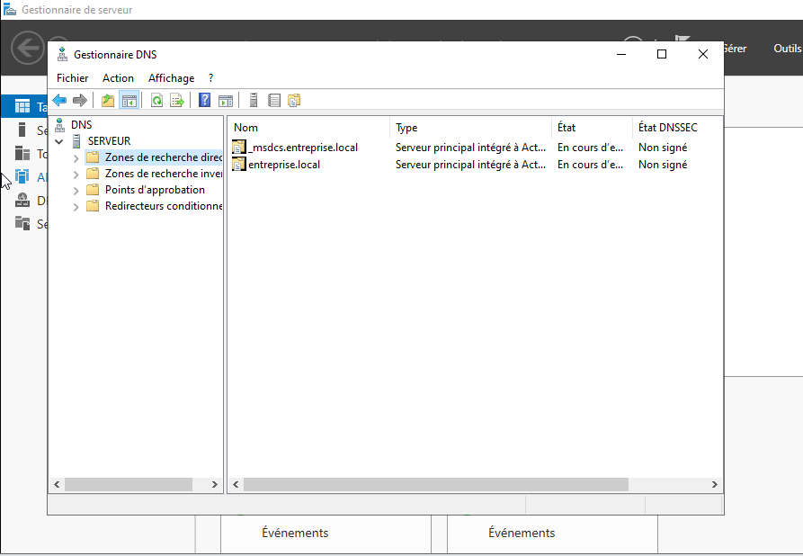
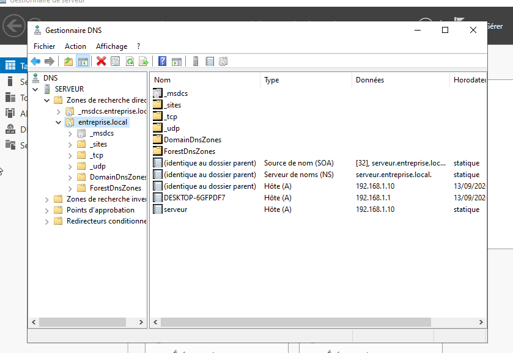
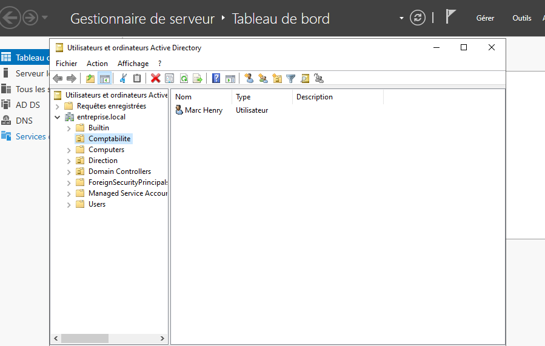
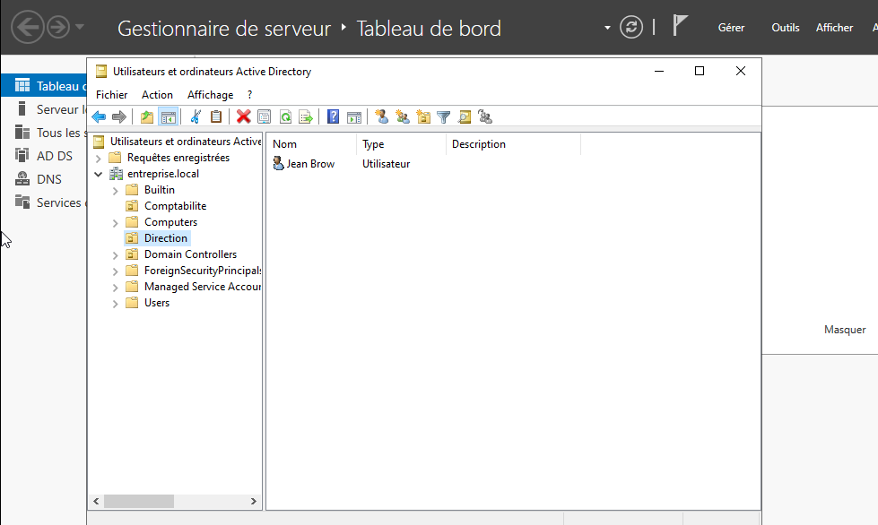
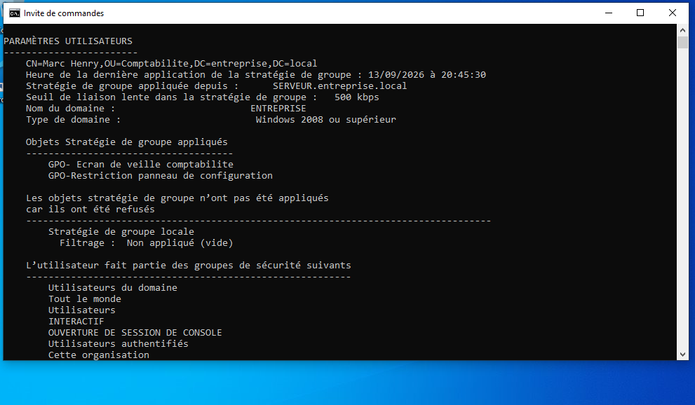
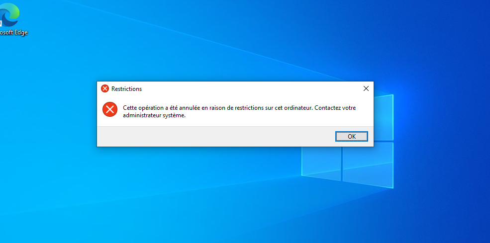
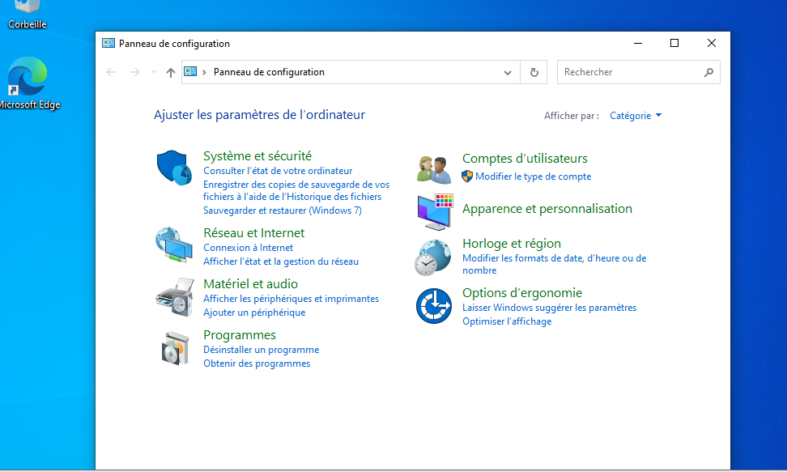

# Mise en place d'une infrastructure Active Directory pour une PME fictive

## Contexte

Ce projet reproduit l'infrastructure de base d'une petite entreprise fictive, ENTREPRISE, avec un contrôleur de domaine Windows Server 2022 et un poste client Windows 10 rejoignant ce domaine. L'objectif était de comprendre et de manipuler concrètement les briques fondamentales d'Active Directory : domaine, DNS, unités d'organisation, utilisateurs et stratégies de groupe.

## Environnement technique

- Windows Server 2022 (contrôleur de domaine)
- Windows 10 x64 (poste client)
- VMware Workstation pour la virtualisation
- Domaine : entreprise.local

## Étapes réalisées

### 1. Installation et configuration du contrôleur de domaine

Le serveur a été installé sur une machine virtuelle avec une adresse IP fixe (192.168.1.10), condition nécessaire pour qu'un contrôleur de domaine reste toujours joignable à la même adresse. Le rôle Services de domaine Active Directory a ensuite été ajouté, suivi de la promotion du serveur en contrôleur de domaine pour la nouvelle forêt entreprise.local.

### 2. Vérification du DNS

La promotion en contrôleur de domaine installe et configure automatiquement le rôle DNS, condition indispensable au bon fonctionnement d'Active Directory. La zone de recherche directe entreprise.local a été vérifiée : elle contient les enregistrements Hôte (A) du serveur, ainsi que les enregistrements techniques (SOA, NS, _msdcs, _sites, _tcp, _udp) générés automatiquement pour la localisation des services du domaine.

### 3. Structure organisationnelle

Deux unités d'organisation ont été créées : Comptabilité et Direction. Un utilisateur a été ajouté dans chacune (Marc Henry dans Comptabilité, Jean Brow dans Direction). Cette séparation permet d'appliquer des règles différenciées selon le service, plutôt qu'une politique unique pour toute l'entreprise.

### 4. Stratégie de groupe (GPO)

Une GPO nommée "GPO- Ecran de veille comptabilite" a été créée et liée à l'OU Comptabilité, avec un délai d'expiration de l'écran de veille fixé à 120 secondes. Contrairement à la politique de mot de passe, qui ne peut être modifiée qu'au niveau du domaine entier (sauf recours aux stratégies de mot de passe affinées), cette règle a pu être appliquée à une seule OU, sans affecter les autres services.

### 5. Test sur un poste client

Un poste Windows 10 a été joint au domaine, avec son DNS pointé manuellement vers le contrôleur de domaine (192.168.1.10). La connexion avec le compte de Marc Henry a permis de vérifier, via la commande `gpresult /r`, que la GPO était correctement reçue et appliquée :

Aucun objet n'a été refusé, ce qui confirme une application propre de la stratégie.

### 6. Deuxième GPO : restriction du Panneau de configuration

Pour vérifier que les règles s'appliquent bien de façon ciblée par OU, et non à l'ensemble du domaine, une seconde GPO a été créée et liée uniquement à l'OU Comptabilité, interdisant l'accès au Panneau de configuration.

Le test a été effectué sur les deux comptes utilisateurs :

- **Marc Henry (OU Comptabilité)** : tentative d'ouverture du Panneau de configuration bloquée, avec le message "Cette opération a été annulée en raison de restrictions sur cet ordinateur. Contactez votre administrateur système."

- **Jean Brow (OU Direction)** : accès normal au Panneau de configuration, sans aucune restriction.

Ce résultat confirme que la stratégie de groupe s'applique bien uniquement à l'OU ciblée, sans affecter les autres unités organisationnelles du domaine — c'est précisément l'intérêt de structurer un domaine en OU plutôt que d'appliquer une politique unique à tous les utilisateurs.

## Difficulté rencontrée

Le poste client ne pouvait pas rejoindre le domaine tant que son DNS restait configuré sur une valeur automatique (obtenue via le NAT de VMware) plutôt que sur l'adresse du contrôleur de domaine. Pointer manuellement le DNS du client vers 192.168.1.10 a résolu le problème, ce qui a permis de bien comprendre le rôle du DNS dans la localisation d'un domaine par un poste client.

## Résultat

Une infrastructure Active Directory fonctionnelle de bout en bout : domaine, DNS intégré, structure en unités d'organisation, deux stratégies de groupe distinctes (écran de veille, restriction du Panneau de configuration) appliquées et vérifiées sur un poste client réel, avec une démonstration claire de l'application différenciée des règles selon l'OU.

## Prochaine étape

Ajouter un deuxième contrôleur de domaine pour observer la réplication Active Directory, ou introduire une première brique cloud (par exemple une VM Azure) pour amorcer un scénario d'infrastructure hybride.

## Extension du projet : réplication et tolérance de panne suivie de Voir la documentation complète et un lien markdown vers le nouveau fichier : [replication.md](replication.md)
