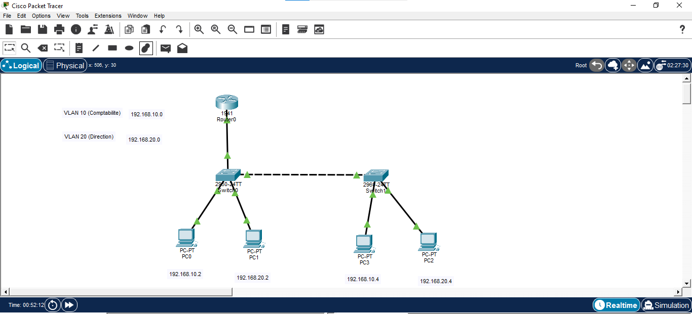
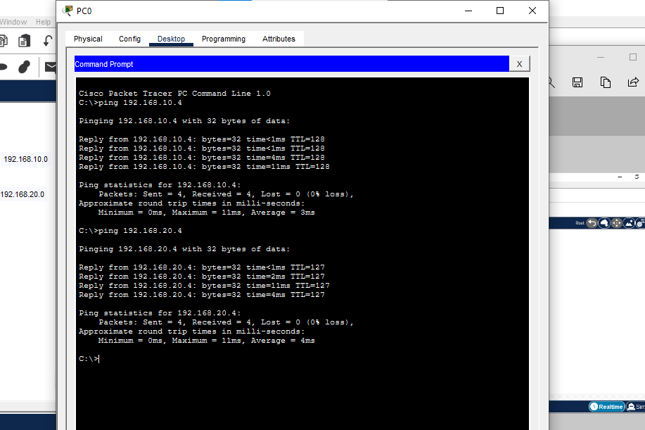
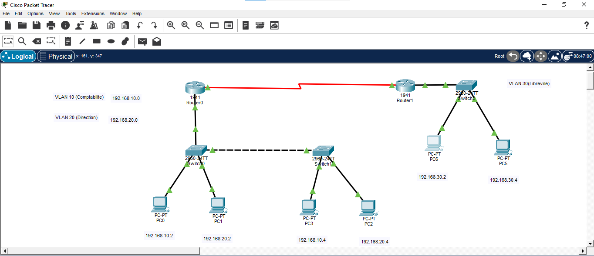
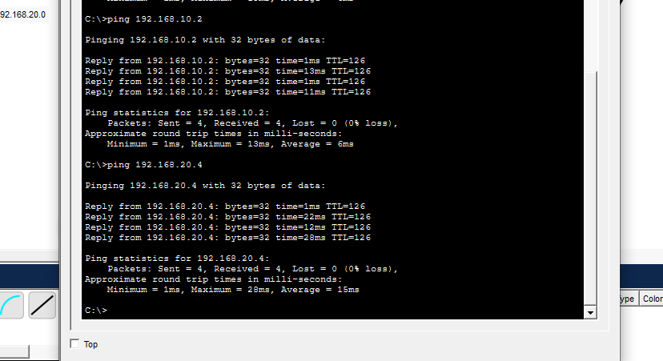
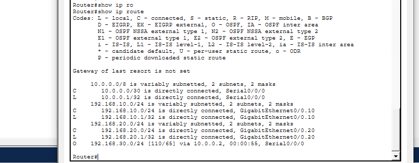
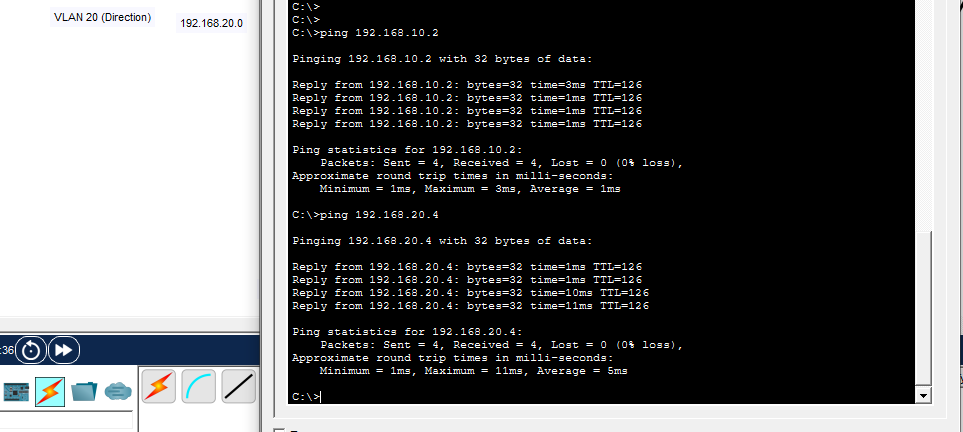

# Interconnexion réseau : VLAN, routage inter-VLAN et routage inter-sites
## Contexte

Ce projet complète le labo ENTREPRISE avec la partie réseau qui manquait encore : la segmentation en VLAN, le routage entre VLAN, et le routage statique entre deux sites distincts. L'objectif était de reproduire une topologie représentative d'une petite entreprise répartie sur deux emplacements, avec une gestion différenciée du trafic par service.

Environnement technique
Cisco Packet Tracer
2 routeurs (Cisco 1941)
3 switches (Cisco 2960)
6 PC répartis sur trois VLAN
## Liaison série entre les deux routeurs (simulation d'un lien WAN inter-sites)
## Topologie

### Site 1

VLAN 10 (Comptabilité) — réseau 192.168.10.0/24
VLAN 20 (Direction) — réseau 192.168.20.0/24
Deux switches reliés en trunk, chacun hébergeant des PC des deux VLAN
Router0 en configuration router-on-a-stick, avec sous-interfaces dédiées à chaque VLAN

### Site 2 (Libreville, fictif)

VLAN 30 — réseau 192.168.30.0/24
Router1, relié à Router0 via une liaison série représentant le lien WAN entre les deux sites
Étapes réalisées
## 1. Segmentation en VLAN

Les VLAN 10 et 20 ont été créés sur les deux switches du site 1, avec des PC des deux VLAN répartis sur chacun des deux switches plutôt que regroupés par switch. Cette répartition permet de démontrer que la segmentation VLAN est indépendante de la topologie physique : deux appareils du même VLAN communiquent normalement même s'ils sont connectés à des switches différents, tandis que deux appareils de VLAN différents restent isolés même sur un même switch.

### 2. Liens trunk

Le lien entre les deux switches, ainsi que le lien entre le switch et le routeur, ont été configurés en mode trunk, pour transporter le trafic des deux VLAN simultanément sur un seul câble physique.

### 3. Routage inter-VLAN (router-on-a-stick)

Sur Router0, deux sous-interfaces ont été créées sur l'interface reliée au switch (encapsulation dot1Q), chacune avec l'adresse de passerelle correspondant à son VLAN (192.168.10.1 pour le VLAN 10, 192.168.20.1 pour le VLAN 20).

Un test ping entre deux PC de VLAN différents a confirmé le bon fonctionnement du routage : le TTL de la réponse passait de 128 à 127, preuve que le paquet avait traversé le routeur, contrairement à un ping entre deux PC du même VLAN qui conservait un TTL de 128.

### 4. Ajout d'un deuxième site et routage statique

Un deuxième routeur (Router1) a été ajouté, relié à Router0 par une liaison série représentant un lien WAN entre deux sites. Ce lien a été adressé en /30 (192.168.1.0/30, avec 2 seules adresses utilisables pour les deux extrémités), un choix économique en adresses IP pour un lien point-à-point.

Un troisième réseau (VLAN 30, 192.168.30.0/24) a été créé derrière Router1. Des routes statiques ont ensuite été ajoutées dans les deux sens :

Sur Router0 : route vers 192.168.30.0/24 via Router1
Sur Router1 : routes vers 192.168.10.0/24 et 192.168.20.0/24 via Router0

### 5. Test de connectivité inter-sites

Un ping depuis un PC du site 2 (VLAN 30) vers des PC du site 1 (VLAN 10 et VLAN 20) a réussi dans les deux cas, avec un TTL de 126 — confirmant que le paquet avait traversé deux routeurs successifs (Router1 puis Router0), conformément à la topologie mise en place.

### 6. Remplacement du routage statique par OSPF

Pour comparer les deux approches sur la même topologie, les routes statiques entre les deux sites ont été supprimées et remplacées par le protocole de routage dynamique OSPF, configuré sur les deux routeurs avec les réseaux directement connectés de chacun.

La commande show ip route sur Router0 a confirmé que le réseau du site 2 avait été appris automatiquement, marqué par un O (OSPF) plutôt qu'un S (route statique) :

O    192.168.30.0/24 [110/65] via 10.0.0.2, 00:00:55, Serial0/0/0

Un nouveau test de ping entre les deux sites a donné un résultat identique au test précédent (TTL=126 dans les deux sens), confirmant que le résultat pour l'utilisateur final reste le même, tandis que la façon dont les routeurs apprennent les chemins change radicalement : automatique avec OSPF, contre configuration manuelle et bidirectionnelle avec le routage statique.

### Difficulté rencontrée

Le lien série entre les deux routeurs s'affichait en rouge et vert dans Packet Tracer, ce qui a d'abord semblé indiquer un problème de connexion. Il s'agissait en réalité de l'indication normale des rôles DCE (vert) et DTE (rouge) propres aux liaisons série, sans rapport avec l'état du lien. La configuration du clock rate côté DCE a suffi à établir une liaison fonctionnelle, comme confirmé par les tests de ping réussis.

### Résultat

Une topologie réseau complète et fonctionnelle : trois VLAN répartis sur deux sites, routage inter-VLAN via router-on-a-stick sur le premier site, et connectivité inter-sites testée avec deux approches différentes — routage statique puis routage dynamique OSPF. Les deux méthodes ont donné le même résultat final, mais OSPF a permis d'obtenir cette connectivité sans configuration manuelle des routes, ce qui illustre concrètement l'intérêt du routage dynamique à mesure qu'un réseau grandit.

### Prochaine étape

Ajouter un troisième site relié par OSPF et observer la propagation automatique de la nouvelle route sur les routeurs existants, sans aucune reconfiguration manuelle de leur part.
